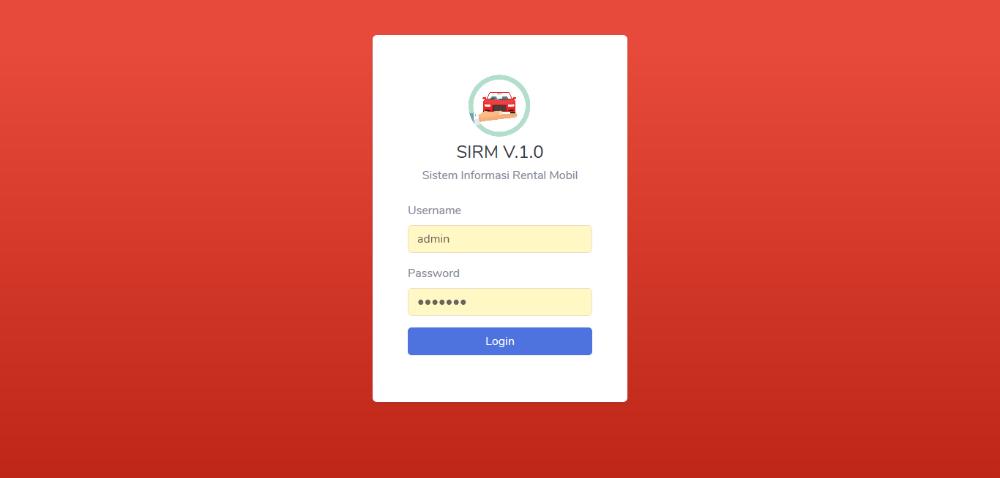

Sistem Requirement :

    Bahasa : PHP 7.2
    Database : MySQL
    Server : Xampp

Panduan Instalasi :

    Download dan Instal aplikasi Xampp dan Composer di Komputer.
    Ekstrak file menggunakan aplikasi WinRAR.
    Copy folder RentalMobil, lalu paste ke folder htdocs.
    Aktifkan Apache dan MySQL pada Xampp.
    Buka browser, lalu buka alamat localhost/phpmyadmin.
    Buat database baru dengan nama rentalmobil.
    Import database aplikasi ke dalam database rentalmobil.
    Buka terminal di dalam aplikasi, ketikan php artisan serve.
    Jalankan aplikasi dengan ketik http://127.0.0.1:8000.
    Login dengan email : admin, Password : rahasia.

Fitur Aplikasi :

    Login Multi User
    Dashboard
    Data Mobil
    Data Merk
    Data Customer
    Data Transaksi
    Data Pengguna
    Pengaturan
    LogOut
    dan lainnya.

----------------------------------------------------------------

## Car Rental

Aplikasi Rental Mobil berbasis web dibangun dengan laravel 5.8 dan Mysql

## Fiitur

1. Management Pengguna
2. Management Mobil
3. Management Customer
4. Management Transaksi
5. Management List Transaksi Aktif
5. Management History Transaksi
6. Management Setting Aplikasi
7. Management Print Kuitansi Transaksi
8. Management Export Data Transaksi Via Excel
9. Integrasi dengan website (optional)

